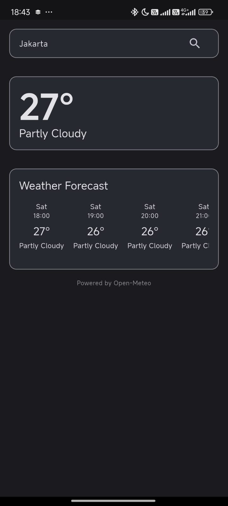

# Tenki

Simple and lightweight weather app without clutter and catchy ui build using Flutter and Powered by Open-Meteo


## Why This Even Exist ?
I don't like the default weather apps that come with most Android phones nowadays. There’s too much going on, and I feel overwhelmed just opening the app. Most of the UIs are designed to be catchy, which actually makes it harder for me to get the information I need. That's why I made this app for myself.
## Features

- Find your location manually or use location services to find it automatically.
- Weather Temperature & Forecast
- Dark/light mode based on your system settings
- Awful material design 3 implementation


## Screenshots


Oppo A5 2020 (ColorOS 7.1, Android 10)


Redmi Note 12 (HyperOS 1.0, Android 13)


## Build
Clone this Project
```bash
git clone https://github.com/g4mless/tenki.git
cd tenki
```
Install Dependencies
```bash
flutter pub get
```
Build
```bash
flutter build apk --release --split-per-abi
```
And you should be get apk for arm64-v8a and armeabi-v7a on build directory